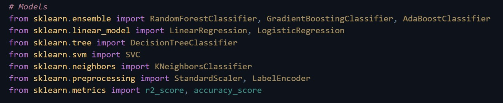

# Diversion-Hackathon
<!DOCTYPE html>
<html>
    <head>
        <title>Ez-Viz</title>
        <meta charset="utf-8">
        <meta name = "viewport" content="width=device-width, initial-scale=1.0">
        <link rel="stylesheet" href="styles.css">
    </head>
    <body>
        <h1>Importing necessary models :</h1>
        
        <h3>
            <ul>
                <li><i>Ensemble Models</i>: RandomForestClassifier, GradientBoostingClassifier, and AdaBoostClassifier are used for robust classification by combining multiple weak models.</li>
                <li><i>Linear Models</i>: LinearRegression (for regression tasks) and LogisticRegression (for binary/multi-class classification).</li>
                <li><i>Tree-Based & SVM Models</i>: DecisionTreeClassifier (decision tree classification) and SVC (Support Vector Classification).</li>
                <li><i>K-Nearest Neighbors</i>: KNeighborsClassifier for instance-based learning.<li>
                <li><i>Preprocessing & Metrics</i>: StandardScaler (feature scaling), LabelEncoder (categorical encoding), r2_score (regression performance), and accuracy_score (classification accuracy).</li>
            </ul>
        </h3>
</body>

</html>